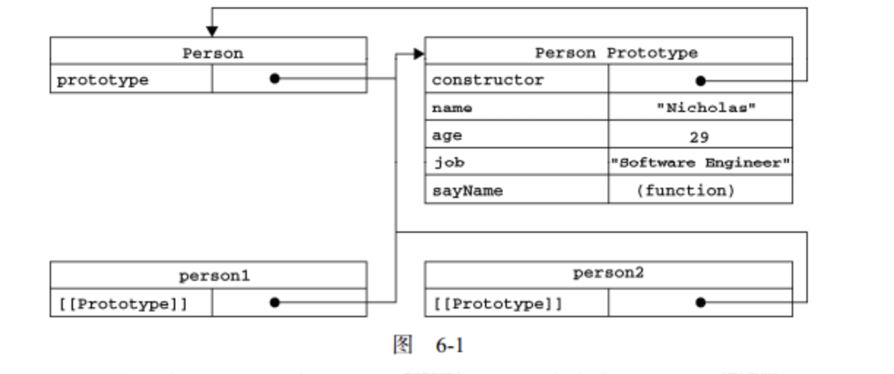
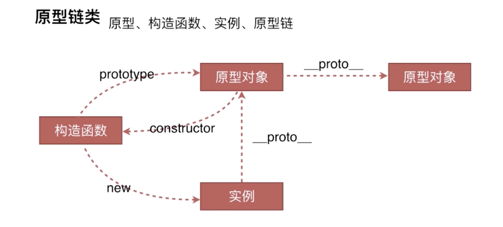

### JS 对象、原型链、继承
#### JS创建对象的3种方式
* 字面量
``` javascript
var o1 = {name:"o1"};
var o2 = new Object({name:"o2"});
```
* 通过构造函数
``` javascript
var M = function(name){
this.name = name
}
var o3 = new M("o3")
```
* Object.create
``` javascript
var p = {name:"o4"};
var o4 = Object.create(p)
```
#### 创建实例
* 只要是一个对象，就是一个实例。要创建一个对象的新实例，必须使用 new 操作符。以这种方式调用构造函数实际上会经历以下 4个步骤：
(1) 创建一个新对象；
(2) 将构造函数的作用域赋给新对象（因此 this 就指向了这个新对象）；
(3) 执行构造函数中的代码（为这个新对象添加属性）；
(4) 返回新对象。
* instanceof 操作符可以验证该对象是否是另一个对象的实例：person1 instanceof Object；只要在原型链上的父级原型，都会返回true；
* 需要用constructor 属性来判断是否是另外一个对象直接生成的实例：
``` javascript
var M = function(name){
this.name = name
}
var o3 = new M("o3")
o3.__proto__.constructor === M ;  // true
o3.__proto__.constructor === Object ;  // false
console.log(o3 instanceof M) // true
console.log(o3 instanceof Object) // true
```
* 创建的每个函数都有一个 prototype（原型）属性，这个属性是一个指针，指向一个对象。如果按照字面意思来理解，那么 prototype 就是通过调用构造函数而创建的那个对象实例的原型对象。在默认情况下，所有原型对象都会自动获得一个 constructor（构造函数）属性，这个属性包含一个指向 prototype 属性所在函数的指针。使用原型对象的好处是可以让所有对象实例共享它所包含的属性和方法。


#### 原型链



#### 继承
#### 类的声明
``` javascript
// ES5 
function Animal(name){
	this.name = name；
}
// ES6 
class Animal2
	constructor(name){
		this.name = name;
	}
}
```
#### 实例化
``` javascript
var dog = new Animal("dog");
var cat = new Animal2("cat");
```
#### 继承
* 原型链
	* 缺点：
		* 在通过原型来实现继承时，原 型实际上会变成另一个类型的实例。引用类型值的原型属性会被所有实例共享
		* 在创建子类型的实例时，不能向超类型的构造函数中传递参数
* 构造函数
	* 优点：相对于原型链而言，借用构造函数有一个很大的优势，即可以在子类型构造函数中向超类型构造函 数传递参数。
	* 缺点：无法避免构造函数模式存在的问题——方法都在构造函数中定 义，因此函数复用就无从谈起了
* 组合继承
	* 缺点：无论什么情况下，都会调用两次超类型构造函数:一次是在创建子类型原型的时候，另一次是 在子类型构造函数内部。
	* 优点：父类的属性方法都可以继承
* 寄生组合式继承
通过借用构造函数来继承属性，通过原型链的混成形式来继承方法
	* 优点：高效率体现在它只调用了一次 SuperType 构造函数，并且因此避免了在 SubType. prototype 上面创建不必要的、多余的属性。与此同时，原型链还能保持不变;因此，还能够正常使用 instanceof 和 isPrototypeOf()。
``` javascript
// ES5 
function Animal(name){
	this.name = name；
}
// 构造函数继承
function Dog(){
	Animal.call(this);
	this.type = "dog";
}
// 组合继承
function SuperType(name){
    this.name = name;
    this.colors = ["red", "blue", "green"];
}
SuperType.prototype.sayName = function(){
    alert(this.name);
};
function SubType(name, age){
    SuperType.call(this, name); //第二次调用SuperType()
    this.age = age;
}

SubType.prototype = new SuperType(); //第一次调用SuperType()

SubType.prototype.constructor = SubType;
SubType.prototype.sayAge = function(){
    alert(this.age);
};

// 寄生组合继承
 var prototype = Object.create(SubType.prototype);
    prototype.constructor = SubType;
    SubType.prototype = prototype;
```
