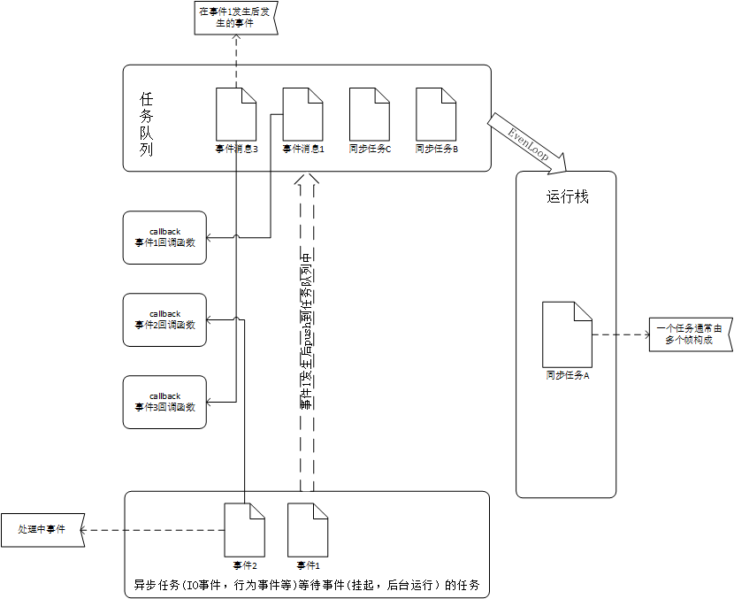
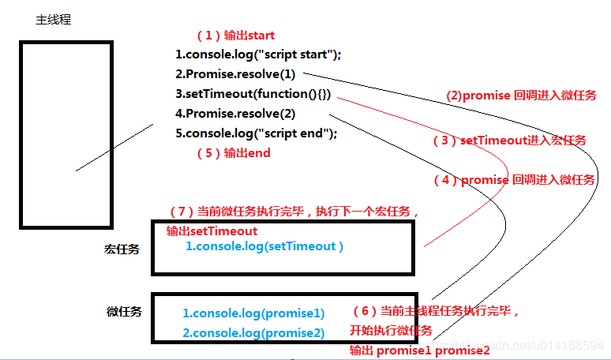

## JS 运行机制
   JS 执行是单线程的，它是基于事件循环的。
   > PS:虽然JavaScript是单线程，但浏览器是多线程的，例如Webkit或是Gecko引擎，可能有javascript引擎线程、界面渲染线程、浏览器事件触发线程、Http请求线程，读写文件的线程
### 如何理解JS单线程？
   一句话讲：一个时间内，JS只能干一件事。
### 什么是任务队列？
分同步任务与异步任务。
执行顺序：先执行同步任务，异步任务会先挂起。
异步任务的放入时间与执行时间：浏览器有个timer模块，主要处理setTimeout,setInterval(),当定时器到了时间才会放入异步队列中，然后等待事件循环执行。
> setTimeout和setInterval的延时最小间隔是4ms（W3C在HTML标准中规定）；在JavaScript中没有任何代码是立刻执行的，但一旦进程空闲就尽快执行。这意味着无论是setTimeout还是setInterval，所设置的时间都只是`n毫秒被添加到队列中`，而`不是过n毫秒后立即执行`。

### 什么是 Event Loop？
* 所有同步任务都在主线程上执行，形成一个执行栈（execution context stack）。
* 主线程之外，还存在一个"任务队列"（task queue）。只要异步任务有了运行结果，就在"任务队列"之中放置一个事件。
* 一旦"执行栈"中的所有同步任务执行完毕，系统就会读取"任务队列"，看看里面有哪些事件。那些对应的异步任务，于是结束等待状态，进入执行栈，开始执行。
* 主线程不断重复上面的第三步。

大白话讲：主线程（js线程）只会做一件事，就是从任务队列里面取消息、执行消息，再取消息、再执行。如果任务队列为空时，就会等待，直到任务队列变成非空。只有当前的消息执行结束，才会去取下一个消息。这种机制就叫做事件循环机制Event Loop，取一个消息并执行的过程叫做一次循环。
主线程（js线程）只会做一件事，就是从任务队列里面取消息、执行消息，再取消息、再执行。如果任务队列为空时，就会等待，直到任务队列变成非空。只有当前的消息执行结束，才会去取下一个消息。这种机制就叫做事件循环机制Event Loop，取一个消息并执行的过程叫做一次循环。
注意三点：
* 运行栈中执行同步任务；`---> 从任务队列中取出的消息，（例如setTimeout中运行体）会变成同步任务 `
* 运行栈何时去任务队列中取任务消息；`---> 运行栈中没有执行的任务了，就会去任务队列中取`
* 何时在任务队列中放置任务消息；`---> 事件发生（例如setTimeout设置的时间到了,点击触发事件了等）`



### 异步任务有哪些？
* setTimeout();
* setInterval() ;
* DOM 事件;
* Promise

### 异步具体过程是什么？
主线程发起一个异步请求，相应的工作线程（比如浏览器的其他线程）接收请求并告知主线程已收到(异步函数返回)；主线程可以继续执行后面的代码，同时工作线程执行异步任务，执行完成后把对应的回调函数封装成一条消息放到任务队列中；主线程不断地从任务队列中取消息并执行，当消息队列空时主线程阻塞，直到任务队列再次非空。

### 延伸

#### setInterval() 缺点
因为定时器指定的时间间隔，表示的是何时将定时器的代码添加到任务队列，而不是何时执行代码。所以真正何时执行代码的时间是不能保证的，取决于何时被主线程的事件循环取到，并执行。所以setInterval(function, N)是每隔N秒把function事件推到任务队列中，但是到底什么时候执行，并不清楚。
举个例子：
假如隔N秒后，将定时器消息	T1添加入任务队列中，此时主线程还有其他任务在执行，则消息T1需要等待，直到主线程其他任务完成后，取T1消息再执行；
过N秒后，此时如果主线程在执行T1,定时器将T2消息添加入任务队列中，等待T1消息执行完；
又过N秒后，如果此时还在执行T1消息，T2则依然在等待，则T3消息不会添加入任务队列中；` --->间隔时间会跳过`
当T1 执行完，就会接着执行T2消息。` --->间隔时间会缩短`
> PS: setInterval()仅当任务队列中没有该定时器的任何消息，才会将定时器的消息添加进任务队列中。
####  链式setTimeout
``` 
setTimeout(function () {
    // 任务
    setTimeout(arguments.callee, interval);
}, interval)
```
>警告：在严格模式下，第5版 ECMAScript (ES5) 禁止使用 arguments.callee()。当一个函数必须调用自身的时候, 避免使用 arguments.callee(), 通过要么给函数表达式一个名字,要么使用一个函数声明.
#### 宏任务与微任务

 （原文链接：https://blog.csdn.net/u014168594/article/details/83510281 ）
 
浏览器为了能够使得 JS 内部 task（任务） 与 DOM 任务能够有序的执行，会在一个 task 执行结束后，在下一个 task 执行开始前，对页面进行重新渲染 （task-> 渲染-> task->…)
* 宏任务（task）：就是上述的 JS 内部（任务队列里）的任务，严格按照时间顺序压栈和执行。如 setTimeOut、setInverter、setImmediate 、 MessageChannel等
* 微任务（Microtask ）：通常来说就是需要在当前 task 执行结束后立即执行的任务，例如需要对一系列的任务做出回应，或者是需要异步的执行任务而又不需要分配一个新的 task，这样便可以减小一点性能的开销。microtask 队列是一个与 task 队列相互独立的队列，microtask 将会在每一个 task 执行结束之后执行。每一个 task 中产生的 microtask 都将会添加到 microtask 队列中，将会添加至当前 microtask 队列的尾部，并且 microtask 会按序的处理完队列中的所有任务，然后开始执行下一个 task 。microtask 类型的任务目前包括了 MutationObserver 以及 Promise 的回调函数。
例子：
``` 
console.log("script start");
Promise.resolve().then(function(){
	console.log("promise1")
})
setTimeout(function(){
    console.log("setTimeout")
},0);
Promise.resolve().then(function(){
	console.log("promise2")
})
console.log("script end");

//输出
//script start
//script end
//promise1
//promise2
//setTimeout
```


``` 
console.log('script start');
Promise.resolve().then(function() {
  	setTimeout(function() {
      console.log('setTimeout1');
    }, 0);
}).then(function() {
  console.log('promise1');
});

setTimeout(function() {
	console.log('setTimeout2')
	Promise.resolve().then(function(){
		console.log('promise2');
	})
},0)
console.log('script end');

//输出：
//script start
//script end
//promise1
//setTimeout2
//promise2
//setTimeout1
```
（1）进入宏任务，执行当前代码，输出 script start

（2）执行 Promise.resolve(1)，回调（内含函数 setTimeout(1)）进入微任务

（3）执行 setTimeout(2)，异步任务先挂起，回调（内含函数 Promise.resolve(2)） 进入下一宏任务

（4）输出 script end，当前宏任务结束。

（5）宏任务结束，查看微任务队列，当前微任务是 Promise.resolve(1) 回调，执行回调里面的 setTimeout(1)，异步任务先挂起，接着输出 promise1，当前微任务为空

（6）当前微任务为空，执行下一宏任务。

（7）setTimeout(2) 时间到了，加入宏任务队列中，setTimeout(1) 时间到了，加入宏任务队列中

（8）当前宏任务是 setTimeout(2)回调，输出 setTimeout2，执行回调里面的 Promise.resolve(2)，回调进入微任务，当前宏任务结束

（9）当前宏任务结束，执行微任务。输出 Promise2，微任务为空。

（10）执行下一宏任务，setTimeout1 回调输出 setTimeout1

#### Promise
Promise本身是**同步的立即执行函数**， 当在executor中执行resolve或者reject的时候, 此时是异步操作， 会先执行then/catch等，当主栈完成后，才会去调用resolve/reject中存放的方法执行，打印p的时候，是打印的返回结果，一个Promise实例。
```
console.log('script start')
let promise1 = new Promise(function (resolve) {
    console.log('promise1')
    resolve()
    console.log('promise1 end')
}).then(function () {
    console.log('promise2')
})
setTimeout(function(){
    console.log('settimeout')
})
console.log('script end')
// 输出顺序: script start->promise1->promise1 end->script end->promise2->settimeout
```


#### async/await
```
async function async1(){
   console.log('async1 start');
    await async2();
    console.log('async1 end')
}
async function async2(){
    console.log('async2')
}

console.log('script start');
async1();
console.log('script end')

// 输出顺序：script start->async1 start->async2->script end->async1 end
```
* async 函数返回的 Promise 对象，**必须等到内部所有await命令后面的 Promise 对象执行完，才会发生状态改变**，除非遇到return语句或者抛出错误。也就是说，只有async函数内部的异步操作执行完，才会执行then方法指定的回调函数。
* async 函数返回一个 Promise 对象，当函数执行的时候，一旦遇到await就会先返回，等到异步操作完成，再接着执行函数体内后面的语句。可以理解为，是让出了线程，跳出了 async 函数体。

```
    async function async1 () {
      console.log('async1 start');
      await new Promise((res, rej) => {
        console.log("Promise异步async1")
        setTimeout(() => {
          console.log("setTimeout中async1")
        }, 50)
        res()
      }).then(res => {
        console.log("Promise异步返回async1")
      })
      await async3().then(res => { console.log("Promise异步返回async3") })
      console.log('async1 end')
    }
    async function async2 () {
      console.log('async2')
      setTimeout(() => {
        console.log("setTimeout中async2")
      }, 50)
      return new Promise((res, rej) => {
        console.log("Promise异步async2")
        res()
      })
    }
    async function async3 () {
      console.log('async3')
      setTimeout(() => {
        console.log("setTimeout中async3")
      }, 50)
      return new Promise((res, rej) => {
        console.log("Promise异步async3")
        res()
      })
    }
    console.log('script start');
    async1();
    console.log('script end')
    async2().then(res => { console.log("Promise异步返回async2") })

// script start
// async1 start
// Promise异步async1
// script end
// async2
// Promise异步async2
// Promise异步返回async1
// async3
// Promise异步async3
// Promise异步返回async2
// Promise异步返回async3
// async1 end
// setTimeout中async1
// setTimeout中async2
// setTimeout中async3
```
